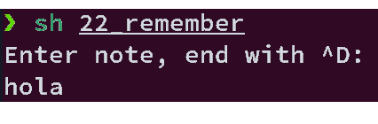

# Script 8: echon
* Script original sin cambios:

```bash
#!/bin/bash
# remindme--Searches a data file for matching lines or, if no
#   argument is specified, shows the entire contents of the data file.

rememberfile="$HOME/.remember"

if [ ! -f $rememberfile ] ; then
  echo "$0: You don't seem to have a .remember file." >&2
  echo "To remedy this, please use 'remember' to add reminders" >&2
  exit 1
fi

if [ $# -eq 0 ] ; then
  # Display the whole rememberfile when not given any search criteria.
  more $rememberfile
else
  # Otherwise, search through the file for the given terms, and display
  # the results neatly.
  grep -i -- "$@" $rememberfile | ${PAGER:-more}
fi

exit 0

echo -n $1
```

* Cambios realizados al Script:

El codigo funciono correctamente, solo hay que ejecutarse como root

* Script corregido:
```bash
#!/bin/bash
rememberfile="$HOME/.remember"

if [ $# -eq 0 ] ; then
  echo "Enter note, end with ^D: "
  cat - >> $rememberfile
else
  echo "$@" >> $rememberfile
fi

rememberfile="$HOME/.remember"

if [ ! -f $rememberfile ] ; then
  echo "$0: You don't seem to have a .remember file." >&2
  echo "To remedy this, please use 'remember' to add reminders" >&2
  exit 1
fi

if [ $# -eq 0 ] ; then
  more $rememberfile
else
  grep -i -- "$@" $rememberfile | ${PAGER:-more}
fi

exit 0
```

* Resultado al ejecutar:

  