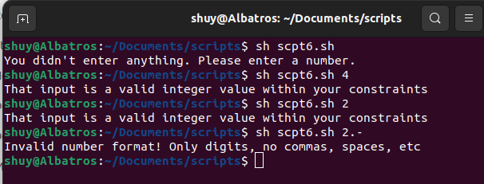

# Script 6: Validador
* Script original sin cambios:

```bash
#!/bin/bash
# validfloat--Tests whether a number is a valid floating-point value.
# Note that this script cannot accept scientific (1.304e5) notation.
# To test whether an entered value is a valid floating-point number,
#we need to split the value into two parts: the integer portion
#and the fractional portion. We test the first part to see whether
#it's a valid integer, and then we test whether the second part is a
#valid >=0 integer. So -30.5 evaluates as valid, but -30.-8 doesn't.
# To include another shell script as part of this one, use the "." source
#
notation. Easy enough.
. validint
validfloat()
{
    fvalue="$1"
    # Check whether the input number has a decimal point.
    if [ ! -z $(echo $fvalue | sed 's/[^.]//g') ] ; then
    # Extract the part before the decimal point.
    decimalPart="$(echo $fvalue | cut -d. -f1)"
    # Extract the digits after the decimal point.
    fractionalPart="${fvalue#*\.}"
    # Start by testing the decimal part, which is everything
    #to the left of the decimal point.

    if [ ! -z $decimalPart ] ; then
    # "!" reverses test logic, so the following is
    #"if NOT a valid integer"
    if ! validint "$decimalPart" "" "" ; then
    return 1
  fi
fi
# Now let's test the fractional value.
# To start, you can't have a negative sign after the decimal point
#like 33.-11, so let's test for the '-' sign in the decimal.
if [ "${fractionalPart%${fractionalPart#?}}" = "-" ] ; then
    echo "Invalid floating-point number: '-' not allowed \
    after decimal point." >&2
  return 1
fi
if [ "$fractionalPart" != "" ] ; then
# If the fractional part is NOT a valid integer...
    if ! validint "$fractionalPart" "0" "" ; then
      return 1
    fi
  fi

else
 # If the entire value is just "-", that's not good either.
if [ "$fvalue" = "-" ] ; then
    echo "Invalid floating-point format." >&2  
    return 1
  fi
# Finally, check that the remaining digits are actually
#valid as integers.
    if ! validint "$fvalue" "" "" ; then
      return 1
   fi
fi
    return 0
}
```

* Cambios realizados al Script:

 En este codigo no se realizo ninguna modificación ya que funcionada correctamente, solo que debe de estar el codigo 5 para que funcione ya que depende de el

* Script corregido:
```bash
  #!/bin/bash
scpt5.sh

validfloat()
{
  fvalue="$1"

  if [ ! -z $(echo $fvalue | sed 's/[^.]//g') ] ; then

    decimalPart="$(echo $fvalue | cut -d. -f1)"
    fractionalPart="${fvalue#*\.}"

    if [ ! -z $decimalPart ] ; then
      if ! scpt5.sh "$decimalPart" "" "" ; then
        return 1
      fi 
    fi

    if [ "${fractionalPart%${fractionalPart#?}}" = "-" ] ; then
      echo "Invalid floating-point number: '-' not allowed \
        after decimal point" >&2
      return 1
    fi 
    if [ "$fractionalPart" != "" ] ; then 
      if ! scpt5.sh "$fractionalPart" "0" "" ; then
        return 1
      fi
    fi
  else 
    if [ "$fvalue" = "-" ] ; then
      echo "Invalid floating-point format." >&2 ; return 1
    fi

    if ! scpt5.sh "$fvalue" "" "" ; then
      return 1
    fi
  fi

  return 0
}
```


* Resultado al ejecutar:
